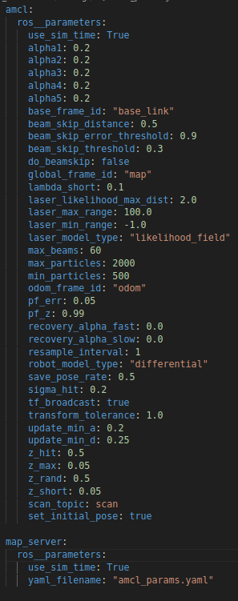

# AMCL (Adaptative Monte Carlo Localization) no ROS2

O pacote **amcl** é um nó de localização baseado no Filtro de Partículas (Monte Carlo Localization - MCL), utilizado para estimar a posição do robô dentro de um mapa previamente conhecido. Ele combina medições de sensores, como Lidar e odometria, para atualizar continuamente a estimativa de pose do robô, permitindo uma navegação autônoma precisa. O AMCL é amplamente utilizado no ROS2 em aplicações de robôs móveis, pois permite compensar erros acumulados na odometria e lidar com incertezas na posição inicial do robô no ambiente.

## 1. Arquivo de configuração do Pacote

Como ainda estamos tratando do problema de localização, vamos utilizar o mesmo pacote criado na última aula para organizar os arquivos de configuração e launch do pacote.

1. Dentro do diretório ```config```, crie o arquivo ```amcl_params.yaml```

2. No arquivo, copie o código seguinte código de configuração:



### Explicação do código

Este arquivo é dividido em duas seções principais: ```amcl``` e ```map_server```.

- ```map_server``` -> Esta seção contém os parâmetros de configuração do pacote ```map_server```, ele será responsável por ler o mapa do nosso ambiente e publica-lo no tópico ```/map```.

- ```amcl```-> Já esta seção irá conter os parâmetros de configuração do pacote AMCL (Adaptative Monte Carlo Localization), que podem ser vistos em mais detalhes [neste link](https://docs.nav2.org/configuration/packages/configuring-amcl.html).

## 2. Utilização do Mapa

Como visto durante a aula, o algoritmo **AMCL** usa como referência global de localização um mapa pré definido do seu ambiente. Nas aulas seguintes iremos entender como construir um mapa, mas por enquanto usaremos um pronto para aplicar o algoritmo.

1. **Adicionar o mapa ao pacote**
    
    - No pacote ```rm_localization```, crie um novo diretório chamado ```map```

    - Copie os arquivos ```my_map.pgm``` e ```my_map.yaml```, disponibilizados no blackboard, para este diretório.
        
        - O arquivo ```my_map.pgm``` é um formato de imagem contendo o mapa, onde os pixels pretos representam as áreas ocupadas (com obstáculos), os brancos as áreas livres, e os cinzas as áreas desconhecidas. 

        - O arquivo ```my_map.ymal``` irá conter informações sobre a imagem do mapa, como resolução e qual tamanho cada pixel corresponde na vida real.
    
    - Adicione o novo diretório no caminho de arquivos a serem instalados pelo ```CMakeLists.txt```.

2. **Abrir mundo correspondente**

    Este mapa foi feito utilizando o mapa disponível no pacote ```robot_description``` colocado no Blackboard. Caso não seja este mundo que você esteja usando, faça o download do mundo e coloque dentro do seu próprio pacote. Lembre-se de indica-lo para ser aberto no ```Launch File``` do **Gazebo**.

## 3. Arquivo de Launch

Copie o arquivo ```amcl.launch.py``` para dentro do diretório ```launch```. Este arquivo irá iniciar os seguintes nodes:


- ```amcl```: Responsável pela localização probabilística do robô no mapa utilizando o Filtro de Partículas (Monte Carlo Localization - MCL). Ele recebe dados do Lidar e da odometria, calcula a posição mais provável do robô e ajusta dinamicamente o número de partículas para otimizar a precisão da localização.

- ```map_server```: Carrega e disponibiliza o mapa do ambiente para os outros nós do ROS2. O AMCL precisa desse mapa para comparar as leituras do Lidar e determinar a posição do robô. O mapa é fornecido no formato Occupancy Grid (células ocupadas/livres).

- ```lyfecycle_manager```: Gerencia o ciclo de vida dos nós do sistema (ex: amcl, map_server). Controla a inicialização e o estado dos nós, garantindo que só entrem em operação quando todos os componentes necessários estiverem prontos.


## 4. Teste

1. Compile o seu workspace e atualize o ambiente.

3. Em um primeiro terminal, abra sua simulação. 

4. Em outro terminal, rode o ```ekf_node``` através da launch file criada na aula passada.

5. Em um terceiro terminal, rode a launch file recém criada, que deve inicializar o **mapa** e o pacote ```amcl``` para realizar o controle do robô.

6. No Rviz, adicione duas visualizações, a do mapa, subscrevendo no tópico ```/map``` e a visualização das partículas criadas pelo algoritmo.

7. Navegue com o robô e veja como o as partículas e o filtro se comportam.

8. Altere os seguintes parâmetros no arquivo de configuração do pacote ```amcl```:

    -  ```min_particles```: Número mínimo de partículas mantidas no sistema. Se o robô estiver bem localizado, o AMCL pode reduzir o número de partículas para economizar processamento.

    - ```max_particles```: Número máximo de partículas que podem ser usadas. Se houver muita incerteza na posição, o AMCL pode aumentar a quantidade de partículas para melhorar a precisão.

    - ```update_min_a``` **(Angular update threshold)**: Define a rotação mínima (em radianos) que o robô precisa realizar antes de o AMCL atualizar as partículas.

    - ```update_min_d``` **(Linear update threshold)**: Define a distância mínima (em metros) que o robô precisa percorrer antes de o AMCL atualizar as partículas.
    
    Avalie como a mudança destes parâmetros influencia na qualidade da localização e no tempo de processamento.

9. Agora, para o caso mais extremo, pause a nevegação e manualmente mova seu robô dentro do seu ambiente. Volte a navegar com ele e veja se é capaz de se localizar novamente.