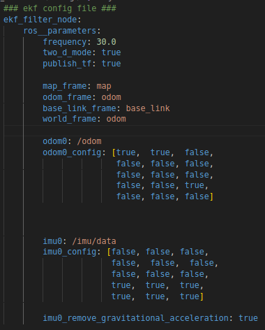

# Fusão de sensores no ROS2

O pacote **robot_localization** é um conjunto de nós e utilitários para realizar fusão de dados de diferentes sensores em um robô móvel, utilizando algoritmos baseados em Filtro de Kalman (ex.: EKF e UKF). Ele é amplamente usado no ROS para combinar medições de sensores como odometria, IMU, GPS, entre outros, de forma a obter uma estimativa consistente da pose (posição e orientação) do robô.

## 1. Criação do Pacote

1. No mesmo workspace da sua simulação do robô, crie o pacote ```rm_localization```:

    ```bash
    ros2 pkg create --build-type ament_python rm_localization
    ```

2. Neste pacote, crie os diretórios:

- ```launch```: Irá conter o arquivo ```ekf.launch.py```, responsável por iniciar o ```ekf_node```.

- ```config```: Irá conter o arquivo ```ekf_config.yaml```, com os parâmetros de configuração do node ```ekf_node```.

## 2. Arquivo de configuração do EKF

1. Dentro do diretório ```config```, crie o arquivo ```ekf_config.yaml```

2. No arquivo, copie o código recém criado:



### Explicação do código

Este arquivo define os parâmetros para o Extended Kalman Filter (EKF) usado no ROS2.

#### Parâmetros Gerais
```yaml
frequency: 30.0
```
- Define a **frequência de atualização** do EKF para 30 Hz, ou seja, o filtro processa novas medições e publica estimativas 30 vezes por segundo.

```yaml
two_d_mode: true
```
- Habilita o **modo 2D**, restringindo a movimentação ao plano XY e desconsiderando valores de inclinação (pitch) e rotação em torno do eixo X e Y.

```yaml
publish_tf: true
``` 
- Define que o nó publicará transformações (```tf```), permitindo a comunicação entre os diferentes frames do sistema de coordenadas do robô. Neste caso, ele publicará a transformada entre os frames ```base_link``` e ```odom```.

#### Frames de referência

```yaml
map_frame: map              
odom_frame: odom            
base_link_frame: base_link  
world_frame: odom 
```

- ```map_frame```: Nome do frame global (mapa). É a referência para localização absoluta, útil para SLAM ou localização global.

- ```odom_frame```: Nome do frame de odometria, referência para movimentação relativa do robô.

- ```base_link_frame```: Nome do frame do robô, representando seu centro físico.

- ```world_frame```: O frame de referência mundial. Aqui, está definido como ```odom```, indicando que a navegação ocorrerá dentro do espaço da odometria (em vez do mapa).

#### Configuração dos Sensores

**Odometria**

```yaml
odom0: /odom
```
- O filtro recebe os dados de odometria publicados no tópico ```/odom```.

```yaml
odom0_config: [true,  true,  false,
               false, false, false,
               false, false, false,
               false, false, true,
               false, false, false]
```

Este array define quais variáveis da odometria serão usadas no EKF. A ordem é:

```bash
[x, y, z, roll, pitch, yaw, vx, vy, vz, vroll, vpitch, vyaw, ax, ay, az]
```
- ```true``` → O EKF usa esse dado.
- ```false``` → O EKF ignora esse dado.

Neste caso:

- Posição em X e Y (```x, y```): Usados.

- Posição em Z (```z```): Ignorada (pois estamos no modo 2D).

- Orientação (```roll, pitch, yaw```): Apenas yaw é utilizado.

- Velocidades lineares (```vx, vy, vz```): Ignora ```vy``` e ```vz```, mantendo apenas ```vx```.

- Velocidades angulares (```vroll, vpitch, vyaw```): Apenas ```vyaw``` é usado.

- Acelerações (```ax, ay, az```): Todas ignoradas.

**IMU**

```yaml
imu0: /imu/data
```

- O filtro recebe dados do sensor IMU publicados no tópico ```/imu/data```.

```yaml
imu0_config: [false, false, false,
              false,  false,  false,
              false, false, false,
              true,  true,  true,
              true,  true,  true]
```

A configuração segue a mesma estrutura das variáveis da odometria.

Neste caso:

- Posição (```x, y, z```): Ignorada.

- Orientação (```roll, pitch, yaw```): Ignorada.

- Velocidades lineares (```vx, vy, vz```): Ignoradas.

- Velocidades angulares (```vroll, vpitch, vyaw```): Todas usadas.

- Acelerações lineares (```ax, ay, az```): Todas usadas.

```yaml
imu0_remove_gravitational_acceleration: true
```

- Habilita a remoção da **aceleração da gravidade** dos dados da IMU, garantindo que apenas acelerações reais do movimento do robô sejam consideradas.


## 3. Arquivo de Launch

1. No diretório ```launch```, crie o arquivo ```ekf.launch.py```.

2. Escreva o código de launch que inicie o node com os seguintes parâmetros:

- **Pacote**: ```robot_localization```

- **Executável**: ```ekf_node```

- **Nome**: ```ekf_filter_node```

- **Parâmetros**: Passe como parâmetro o caminho para o arquivo de configuração e defina o parâmetro ```use_sim_time``` como ```True```.

## 4. Teste

1. No arquivo ```.xacro``` com o plugin do conytrolador differencial, mude o parâmetro ```<publish_odom_tf>``` para ```false```. Agora, o node recém criado que será responsável por publicar a tranformada entre os **frames** ```basel_link``` e ```odom```.

2. Compile o seu workspace e atualize o ambiente.

3. Em um primeiro terminal, abra sua simulação.

4. Em outro terminal, rode o ```ekf_node``` atrav;es da launch file criada, carregando as configurações especificadas no arquivo ```.yaml```.

5. Em um terceiro terminal, rode o node ```twist_teleop_keyboard```, para realizar o controle do robô.

6. Veja se a odometria filtrada do robô está sendo publicada no tópico ```/odometry/filtered```.

7. No Rviz, verifique que o frame ```odom``` está sendo publicado e também a tranformada entre o ele e o frame ```base_link```.

8. Navege com o robô por um tempo e retorne a um ponto de referência (pode ser a origem). Verifique se tanto o gazebo quanto o rviz apresentam posisões similares para o robô.

