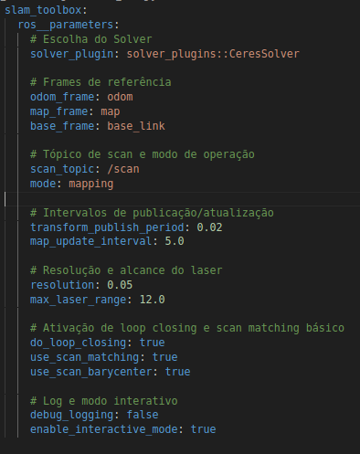
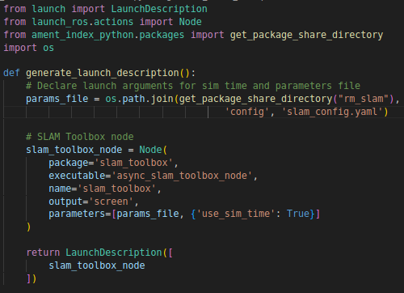
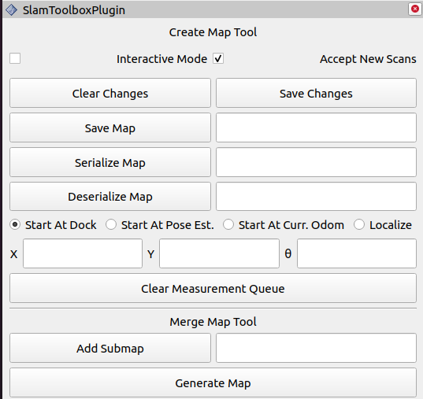

# SLAM (Simultaneous Localization and Mapping) no ROS2

O pacote **slam_toolbox** é uma solução de SLAM (Simultaneous Localization and Mapping) para o ROS2, que permite a construção e atualização incremental de mapas ao mesmo tempo em que localiza o robô. Ele combina medições de sensores, como Lidar e odometria, ajustando continuamente a pose estimada por meio de técnicas avançadas. Dessa forma, o **slam_toolbox** corrige erros acumulados na odometria e fornece uma localização precisa, sendo amplamente utilizado em aplicações de robôs móveis para navegação autônoma em ambientes conhecidos ou parcialmente desconhecidos.

## 1. Criação do Pacote

1. No mesmo workspace da sua simulação do robô, crie o pacote ```rm_slam```:

    ```bash
    ros2 pkg create --build-type ament_python rm_slam
    ```

2. Neste pacote, crie os diretórios:

- ```launch```: Irá conter o arquivo ```slam.launch.py```, responsável por iniciar o pacote ```slam_toolbox```.

- ```config```: Irá conter o arquivo ```slam_config.yaml```, com os parâmetros de configuração do pacote ```slam_toolbox```.

## 2. Arquivo de configuração do Pacote

Assim como os algorítmos utilizados nas últimas aulas, este pacote será configurado através de um arquivo ```.yaml```.

1. Dentro do diretório ```config```, crie o arquivo ```slam_config.yaml```

2. No arquivo, copie o seguinte código de configuração:



### Parâmetros Essenciais

1. **solver_plugin: solver_plugins::CeresSolver**

- Define o tipo de otimizador usado para ajustar as poses e fechar loops.

2. **odom_frame / map_frame / base_frame**

- Especificam os nomes dos frames de referência (odometria, mapa e base do robô), necessários para o sistema de transformações (TF).

3. **scan_topic: /scan**

- Tópico de onde o slam_toolbox obtém dados do Lidar ou sensor de varredura.
4. **mode: mapping**

- Define o modo de operação básico para construção e refinamento de mapas.

5. **transform_publish_period: 0.02**

- Frequência (em segundos) de publicação das transformações TF para map -> odom (ou similar).

6. **map_update_interval: 5.0**

- Intervalo (em segundos) em que o mapa é atualizado com as últimas leituras.

7. **resolution: 0.05**

- Resolução do mapa em metros por célula (5 cm). Define o nível de detalhe no grid.
	
8. **max_laser_range: 12.0**

- Alcance máximo (em metros) das leituras de laser consideradas na construção do mapa.

9. **do_loop_closing: true**

- Ativa o fechamento de loop. Essencial para reduzir erros acumulados ao revisitar áreas já mapeadas.

10.	**use_scan_matching: true / use_scan_barycenter: true**

- Ativa o ajuste contínuo de scans para melhorar a localização. O barycenter (centroide) ajuda na estabilidade do matching.

11.	**debug_logging: false / enable_interactive_mode: true**

- Controla se serão mostradas mensagens de depuração e se o modo interativo (edição/manipulação do mapa em RViz) estará disponível.


## 3. Arquivo de Launch

No diretório ```launch```, escreva o seguinte arquivo de **launch**: 



Este arquivo será responsável por inicializar o pacote **slam_toolbox** no modo ***Online Async***, ou seja, ele irá criar o mapa em tempo real enquanto navegamos (**online**) e também conseguirá processar dados recebidos de forma assíncrona (**async**). Como parâmetro de entrada, ele irá receber o arquivo com os parâmetros de configuração.

## 4. Teste

1. Compile o seu workspace e atualize o ambiente.

3. Em um primeiro terminal, abra sua simulação. 

4. Em outro terminal, rode o ```ekf_node``` através da **launch file** criada anteriormente.

5. Em um terceiro terminal, rode a launch file recém criada, que deve inicializar o pacote **slam_toolbox**.

6. No Rviz, adicione a visualizações, a do mapa, subscrevendo no tópico ```/map``` e a visualização de um **MarkerArray**, subscrevendo no tópico ```/slam_toolbox/graph_visualization```.

7. Navegue com o robô e, aos poucos, crie o mapa do seu ambiente.

8. Uma vez completo, salve o mapa. Isso pode ser feito através de uma ferramenta do próprio pacote no **rviz**.
    - Na barra de ferramentas do **rviz**, clie em ```Panels``` e depois em ```Add New Panel```.
    
    - Adicione o painel ```SlamToolboxPlugin```, que deve adionar o seguinte painel ao **rviz**:

    

    - Ao lado de ```Save Map```, nomeie o seu mapa e clique em salvar. Os arquivos do mapa serão salvos no mesmo diretório em que você inicializou o **rviz**.

- Após o passo anterior, serão criados dois arquivos, com extensão ```.pgm``` e ```.yaml```. O primeiro, é uma imagem contendo o mapa de ocupação criado, onde os pixels pretos representam áreas ocupadas, os brancos áreas livres, e o cinzas áreas desconhecidas. Já o segundo irá conter informações sobre este mapa, como sua resolução e sua origem.

9. Agora, volte na aula anterior e reconfigure o caminho (***path*** )indicado para utilização do mapa com o pacote **AMCL**. Siga os passos da aula anterior para rodar este pacote e veja se seu robô é capaz de se localizar no mapa recém criado.