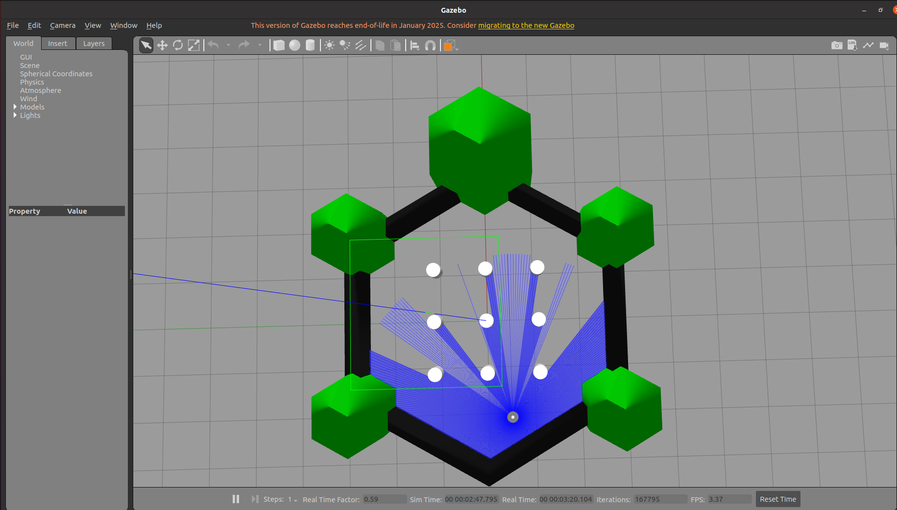
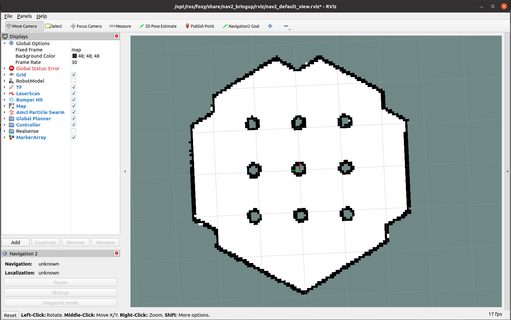
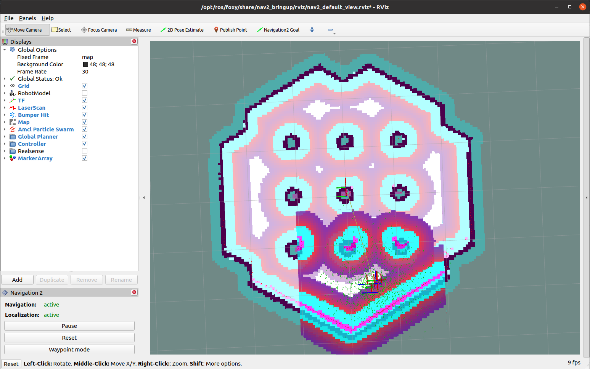
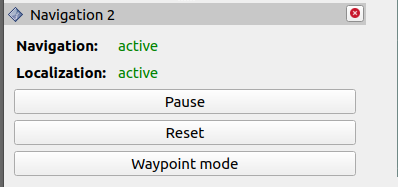
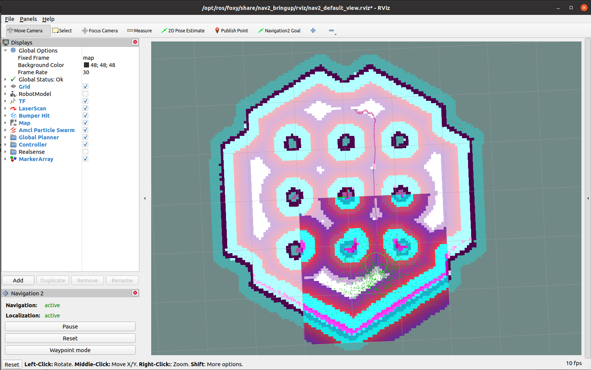

# Aula 16 - Introdução ao pacote de navegação do ROS2 (Nav2)

Nesta aula, iremos inicializar uma simulação de exemplo utilizando o robô **Turtlebot3**, já configurado com todos os elementos do pacote de navegação **Nav2**. O objetivo será começar a se familiarizar com a interface utilizada e seus módulos.


## 1. Instalação de Pacotes

1. Instale o pacote do **navigation2**, ele irá conter todas as bibliotecas necessárias para realização da navegação autônoma, incluindo planejadores de rota e controladores.

    ```bash
    sudo apt install ros-foxy-navigation2 
    sudo apt install ros-foxy-nav2-bringup
    ```

2. Agora, instale os pacotes relacionados ao turtlebot3, este será o robô de exemplo que usaremos para ilustrar o funcionamento do **nav2**.

    ```bash
    sudo apt install ros-foxy-turtlebot3* 
    ```

3. Por último será instalada uma versão diferente do **DDS** utilizado pelo ROS. Por padrão, o ROS2 utiliza uma distribuição chamada **FastDDS**, porém, ela não possui uma boa compatibilidade com os pacotes utilizado pelo Nav2. Portanto, iremos substituir por outra distribuição chamada **CycloneDDS**.

    ```bash
    sudo apt install ros-foxy-rmw-cyclonedds-cpp
    ```

## 2. Configuração do ambiente

No final do seu arquivo ```~/.bashrc```, adicione as seguintes linhas:

1. Configurar variáveis do pacote **turtlebot3**

    ```bash
    export TURTLEBOT3_MODEL=burguer
    export GAZEBO_MODEL_PATH=$GAZEBO_MODEL_PATH:/opt/ros/foxy/share/turtlebot3_gazebo/models
    ```

    Estas variáveis irão definir qual modelo de robô será utilizado para simulação e especificar o caminho para que o gazebo encontre os modelos referentes ao robô.

2. Configurar o **DDS** como **CycloneDDS**:

    ```bash
    export RMW_IMPLEMENTATION=rmw_cyclonedds_cpp
    ```

3. Depois de realizar os passoas acima e salvar o arquivo ```~/.bashrc```, atualize o ambiente:

    ```bash
    source ~/.bashrc
    ```

## 3. Inicializando a simulação

O pacote **nav2_bringup** contém um exemplo de **launch file** que inicializa uma simulação completa, utilizando o turtlebot3 e todos os pacotes necessários para navegação autônoma. 

Em um terminal, execute o seguinte comando:

```bash
ros2 launch nav2_bringup tb3_simulation_launch.py
``` 

Este comando deve abrir o ambiente do gazebo, juntamente com o rviz já configurado com todos os elementos utilizados pelo **Nav2**.





Uma vez inicializado por completo o ambiente de simulação, siga os passos abaixo:

1. **Defina a posição inicial do robô** 

    Por padrão, o pacote de localização **AMCL** precisa de uma estimativa da posição inicial do robô. Na barra superior de ferramentas do ```rviz```, clique em ```2D Pose Estimate``` e indique no mapa a posição e orientação do robô, com base em sua localização no ```gazebo```.

    Uma vez definida, o algorítimo comecará a publicar a transformada entre a posição do robô e do mapa, sendo possível visualizar os dados dos sensores e algorítmos.

    

2. **Verifique o status do Nav2**

    Na barra lateral esquerda, você deve ver um painel referente ao **Nav2**

    

    Veja se os campos ```Navigation``` e ```Localization``` se encontram como ```Active```.

    Isso indica que tando o servidores necessários para a navegação como o algorítimo de localização (**AMCL**) foram inicializados corretamente.

3. **Envie um comando de navegação**

    Novamente, na barra superior de ferramentas do ```rviz```, clique em ```Navigation2 Goal``` e selecione um ponto no mapa. O robô deve planejar uma rota até o ponto selecionado e começar a realizar a navegação.

    

## 4. Enviando múltiplos waypoints

O **Nav2**, além de pontos únicos, permite o envio de múltiplos waypoints como objetivo de navegação, a serem realizados sequencialmente.

1. **Ative o modo ```Waypoint mode```**

    No painel lateral ```Navigation 2```, clique em ```Waypoint mode```.

2. **Adicione Waypoints**

    Utilizando novamente a ferramenta ```Navigation2 Goal```, adicione pelo menos três pontos no mapa a serem alcaçados.

    Note que a cada ponto adicionado, é necessário selecionar novamente a ferramenta ```Navigation2 Goal```.

3. **Inicie a navegação**

    Novamente, no painel lateral ```Navigation 2``` clique em ```Start Navigation```.

    Você verá o robô planejar a rota e navegar até o primeiro ponto. Uma vez alcançado o objetivo, ele deverá planejar a rota e navegar ao segundo ponto, e assim por diante completar os pontos especificados.

## 5. Indicar um arquivo de configuração

O arquivo de lançamento que estamos utilizando para inicializar o **Nav2** está definido dentro do pacote ```nav2_bringup```. Para que seja possível alterar parâmetros durante as próximas aulas, vamos trazer este arquivo para o nosso workspace e indica-lo ao inicializar a simulação. Isso também irá facilitar, no futuro, a configuração e implementaÇão do **Nav2** no seu robô.

1. No diretório ```src``` do seu **workspace**, crie o pacote ```rm_navigation```:

    ```bash
    ros2 pkg create rm_navigation --build-type ament_python --dependencies rclpy 
    ```

2. Dentro do pacote criado, adicione as pastas ```config``` e ```launch```. Lembre-se de adicioná-las aos diretórios a serem compilados ao se execultar ```colcon build```.

3. No diretório ```config```, crie o arquivo de configuração ```nav2_params.yaml``` e copie os parâmetros abaixo:

    ```yaml
    amcl:
    ros__parameters:
        use_sim_time: True
        alpha1: 0.2
        alpha2: 0.2
        alpha3: 0.2
        alpha4: 0.2
        alpha5: 0.2
        base_frame_id: "base_footprint"
        beam_skip_distance: 0.5
        beam_skip_error_threshold: 0.9
        beam_skip_threshold: 0.3
        do_beamskip: false
        global_frame_id: "map"
        lambda_short: 0.1
        laser_likelihood_max_dist: 2.0
        laser_max_range: 100.0
        laser_min_range: -1.0
        laser_model_type: "likelihood_field"
        max_beams: 60
        max_particles: 2000
        min_particles: 500
        odom_frame_id: "odom"
        pf_err: 0.05
        pf_z: 0.99
        recovery_alpha_fast: 0.0
        recovery_alpha_slow: 0.0
        resample_interval: 1
        robot_model_type: "differential"
        save_pose_rate: 0.5
        sigma_hit: 0.2
        tf_broadcast: true
        transform_tolerance: 1.0
        update_min_a: 0.2
        update_min_d: 0.25
        z_hit: 0.5
        z_max: 0.05
        z_rand: 0.5
        z_short: 0.05
        scan_topic: scan

    amcl_map_client:
    ros__parameters:
        use_sim_time: True

    amcl_rclcpp_node:
    ros__parameters:
        use_sim_time: True

    bt_navigator:
    ros__parameters:
        use_sim_time: True
        global_frame: map
        robot_base_frame: base_link
        odom_topic: /odom
        enable_groot_monitoring: True
        groot_zmq_publisher_port: 1666
        groot_zmq_server_port: 1667
        default_bt_xml_filename: "navigate_w_replanning_and_recovery.xml"
        plugin_lib_names:
        - nav2_compute_path_to_pose_action_bt_node
        - nav2_follow_path_action_bt_node
        - nav2_back_up_action_bt_node
        - nav2_spin_action_bt_node
        - nav2_wait_action_bt_node
        - nav2_clear_costmap_service_bt_node
        - nav2_is_stuck_condition_bt_node
        - nav2_goal_reached_condition_bt_node
        - nav2_goal_updated_condition_bt_node
        - nav2_initial_pose_received_condition_bt_node
        - nav2_reinitialize_global_localization_service_bt_node
        - nav2_rate_controller_bt_node
        - nav2_distance_controller_bt_node
        - nav2_speed_controller_bt_node
        - nav2_truncate_path_action_bt_node
        - nav2_goal_updater_node_bt_node
        - nav2_recovery_node_bt_node
        - nav2_pipeline_sequence_bt_node
        - nav2_round_robin_node_bt_node
        - nav2_transform_available_condition_bt_node
        - nav2_time_expired_condition_bt_node
        - nav2_distance_traveled_condition_bt_node

    bt_navigator_rclcpp_node:
    ros__parameters:
        use_sim_time: True

    controller_server:
    ros__parameters:
        use_sim_time: True
        controller_frequency: 20.0
        min_x_velocity_threshold: 0.001
        min_y_velocity_threshold: 0.5
        min_theta_velocity_threshold: 0.001
        progress_checker_plugin: "progress_checker"
        goal_checker_plugin: "goal_checker"
        controller_plugins: ["FollowPath"]

        # Progress checker parameters
        progress_checker:
        plugin: "nav2_controller::SimpleProgressChecker"
        required_movement_radius: 0.5
        movement_time_allowance: 10.0
        # Goal checker parameters
        goal_checker:
        plugin: "nav2_controller::SimpleGoalChecker"
        xy_goal_tolerance: 0.25
        yaw_goal_tolerance: 0.25
        stateful: True
        # DWB parameters
        FollowPath:
        plugin: "dwb_core::DWBLocalPlanner"
        debug_trajectory_details: True
        min_vel_x: 0.0
        min_vel_y: 0.0
        max_vel_x: 0.26
        max_vel_y: 0.0
        max_vel_theta: 1.0
        min_speed_xy: 0.0
        max_speed_xy: 0.26
        min_speed_theta: 0.0
        # Add high threshold velocity for turtlebot 3 issue.
        # https://github.com/ROBOTIS-GIT/turtlebot3_simulations/issues/75
        acc_lim_x: 2.5
        acc_lim_y: 0.0
        acc_lim_theta: 3.2
        decel_lim_x: -2.5
        decel_lim_y: 0.0
        decel_lim_theta: -3.2
        vx_samples: 20
        vy_samples: 5
        vtheta_samples: 20
        sim_time: 1.7
        linear_granularity: 0.05
        angular_granularity: 0.025
        transform_tolerance: 0.2
        xy_goal_tolerance: 0.25
        trans_stopped_velocity: 0.25
        short_circuit_trajectory_evaluation: True
        stateful: True
        critics: ["RotateToGoal", "Oscillation", "BaseObstacle", "GoalAlign", "PathAlign", "PathDist", "GoalDist"]
        BaseObstacle.scale: 0.02
        PathAlign.scale: 32.0
        PathAlign.forward_point_distance: 0.1
        GoalAlign.scale: 24.0
        GoalAlign.forward_point_distance: 0.1
        PathDist.scale: 32.0
        GoalDist.scale: 24.0
        RotateToGoal.scale: 32.0
        RotateToGoal.slowing_factor: 5.0
        RotateToGoal.lookahead_time: -1.0

    controller_server_rclcpp_node:
    ros__parameters:
        use_sim_time: True

    local_costmap:
    local_costmap:
        ros__parameters:
        update_frequency: 5.0
        publish_frequency: 2.0
        global_frame: odom
        robot_base_frame: base_link
        use_sim_time: True
        rolling_window: true
        width: 1
        height: 1
        resolution: 0.05
        robot_radius: 0.22
        plugins: ["voxel_layer", "inflation_layer"]
        inflation_layer:
            plugin: "nav2_costmap_2d::InflationLayer"
            cost_scaling_factor: 3.0
            inflation_radius: 0.55
        voxel_layer:
            plugin: "nav2_costmap_2d::VoxelLayer"
            enabled: True
            publish_voxel_map: True
            origin_z: 0.0
            z_resolution: 0.05
            z_voxels: 16
            max_obstacle_height: 2.0
            mark_threshold: 0
            observation_sources: scan
            scan:
            topic: /scan
            max_obstacle_height: 2.0
            clearing: True
            marking: True
            data_type: "LaserScan"
        static_layer:
            map_subscribe_transient_local: True
        always_send_full_costmap: True
    local_costmap_client:
        ros__parameters:
        use_sim_time: True
    local_costmap_rclcpp_node:
        ros__parameters:
        use_sim_time: True

    global_costmap:
    global_costmap:
        ros__parameters:
        update_frequency: 1.0
        publish_frequency: 1.0
        global_frame: map
        robot_base_frame: base_link
        use_sim_time: True
        robot_radius: 0.22
        resolution: 0.05
        track_unknown_space: true
        plugins: ["static_layer", "obstacle_layer", "inflation_layer"]
        obstacle_layer:
            plugin: "nav2_costmap_2d::ObstacleLayer"
            enabled: True
            observation_sources: scan
            scan:
            topic: /scan
            max_obstacle_height: 2.0
            clearing: True
            marking: True
            data_type: "LaserScan"
        static_layer:
            plugin: "nav2_costmap_2d::StaticLayer"
            map_subscribe_transient_local: True
        inflation_layer:
            plugin: "nav2_costmap_2d::InflationLayer"
            cost_scaling_factor: 3.0
            inflation_radius: 0.55
        always_send_full_costmap: True
    global_costmap_client:
        ros__parameters:
        use_sim_time: True
    global_costmap_rclcpp_node:
        ros__parameters:
        use_sim_time: True

    map_server:
    ros__parameters:
        use_sim_time: True
        yaml_filename: "turtlebot3_world.yaml"

    map_saver:
    ros__parameters:
        use_sim_time: True
        save_map_timeout: 5000
        free_thresh_default: 0.25
        occupied_thresh_default: 0.65
        map_subscribe_transient_local: False

    planner_server:
    ros__parameters:
        expected_planner_frequency: 20.0
        use_sim_time: True
        planner_plugins: ["GridBased"]
        GridBased:
        plugin: "nav2_navfn_planner/NavfnPlanner"
        tolerance: 0.5
        use_astar: false
        allow_unknown: true

    planner_server_rclcpp_node:
    ros__parameters:
        use_sim_time: True

    recoveries_server:
    ros__parameters:
        costmap_topic: local_costmap/costmap_raw
        footprint_topic: local_costmap/published_footprint
        cycle_frequency: 10.0
        recovery_plugins: ["spin", "back_up", "wait"]
        spin:
        plugin: "nav2_recoveries/Spin"
        back_up:
        plugin: "nav2_recoveries/BackUp"
        wait:
        plugin: "nav2_recoveries/Wait"
        global_frame: odom
        robot_base_frame: base_link
        transform_timeout: 0.1
        use_sim_time: true
        simulate_ahead_time: 2.0
        max_rotational_vel: 1.0
        min_rotational_vel: 0.4
        rotational_acc_lim: 3.2

    robot_state_publisher:
    ros__parameters:
        use_sim_time: True
    ``` 

    Note que nele, temos uma seção para cada um dos servidores do **Nav2** apresentado em aula, com seus respectivos parâmetros de configuração.

4. Inicialize novamente a simulação, agora passando como parâmetro o arquivo localizado no seu workspace:

    ```bash
    ros2 launch nav2_bringup tb3_simulation_launch.py params_file:=/path/to/your/config/file.yaml
    ```

5. Verifique se a simulação e o **Nav2** inicializa corretamente.

## 5. Explore o Nav2

Tome um tempo para explorar a navegação autônoma e o **Nav2**. Envie objetivos de navegação em diferentes pontos, distâncias e ordem para ver como o robô se comporta.

Além disso, na barra lateral do ```rviz```, é possível ver diversas camadas de visualização que foram adicionadas. Estas camadas estão relacionadas com alguns dos servidores que compões o **Nav2**, apresentados em aula. Ative e desative a visualização deles enquanto navega, tentando identificar a que servidor cada um deles está relacionado.


    

    
    