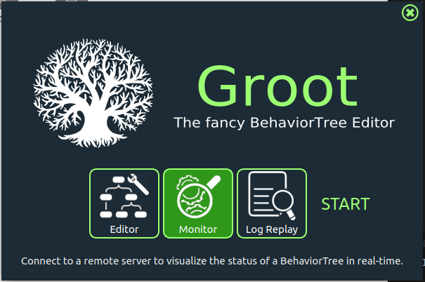

# Aula 17 - Behavior Trees

O objetivo deste exercício será entender e visualizar o funcionamento da **Behavior Tree** utilizada para a navegação com **Nav2**. Para realizar a visualização, será utilizado o software **Groot**. 

Depois, você irá modificar a **Behavior Tree** padrão utilizada pelo **Nav2** para adicionar novos comportamentos.

## 1. Instalação Groot

O primeiro passo será realizar a instalção do **Groot**. Este é um programa utilizado para análise de **Behavior Trees** em qualquer contexto, mas possui uma integração direta com ROS2.

1. **Clone o repositório**

    Em um terminal entre no repositório que deseja instalar o programa (por exemplo, ```home```) e clone o repositório do ```Groot```:

    ```bash
    cd ~
    git clone --recurse-submodules https://github.com/BehaviorTree/Groot.git
    ```

2. **Execulte a compilação e construção (build) do código**

    ```bash
    cd Groot
    cmake -S . -B build
    cmake --build build
    ```

3. **Abra o programa**

    Para iniciar o programa, você deve entrar no diretório ```build``` e execultar ```Groot```:

    ```bash
    cd build
    ./Groot
    ```

    Ao ser execultado, deve abrir a seguinte tela:

    

    Entre as opções, selecione ```Monitor``` e clique em ```start```, a seguinte página deve ser aberta:

    

    Este é modo de visualização de **Behavior Trees**.

## 2. Visualização da Behavior Tree

1. **Inicie a simulação do Turtlebot3**

    ```bash
    ros2 launch nav2_bringup tb3_simulation_launch.py params_file:=/path/to/your/config/file.yaml
    ```

    Lembre-se de definir uma estimativa da posição inicial do robô.

2. **Esbeleça uma conexão entre o ```Groot``` e o ```Nav2```**

    No canto superior esquerdo da tela inical do groot, clique em ```Connect```. Caso os campos ```Server Ip```, ```Publisher Port``` e ```Server Port``` não estiverem preenchidos com valores padrão, preencha de acordo com a imagem abaixo.

    

    Se a conexão com o **ROS2** for bem sucedida, já deverá ser possível visualizar a estrutura da Behavior Tree.

    

3. **Envie um waypoint para o Nav2**

    Utilizando a interface do ```Rviz``` mande um comando de navegação. Uma vez que o robô estiver navegando, volte ao ```Groot```, você deve ver algo como abaixo:

    

    Note que as linhas referentes aos "ramos" da arvore sendo execultados podem assumir as seguintes cores:

    - Verde: A ação foi execultada e retornou **sucesso**

    - Amarelo: A ação está em execução

    - Vermelho: A ação foi finalizada retornando **falha**

## 3. Comparação com arquivo XML

Behavior Trees são escritas, assim como arquivos URDF, em um formato XML. Abaixo está a **Behavior Tree** padrão utilizada pelo **Nav2**:

```xml
<root main_tree_to_execute="MainTree">
  <BehaviorTree ID="MainTree">
    <RecoveryNode number_of_retries="6" name="NavigateRecovery">
      <PipelineSequence name="NavigateWithReplanning">
        <RateController hz="1.0">
          <RecoveryNode number_of_retries="1" name="ComputePathToPose">
            <ComputePathToPose goal="{goal}" path="{path}" planner_id="GridBased"/>
            <ClearEntireCostmap name="ClearGlobalCostmap-Context" service_name="global_costmap/clear_entirely_global_costmap"/>
          </RecoveryNode>
        </RateController>
        <RecoveryNode number_of_retries="1" name="FollowPath">
          <FollowPath path="{path}" controller_id="FollowPath"/>
          <ClearEntireCostmap name="ClearLocalCostmap-Context" service_name="local_costmap/clear_entirely_local_costmap"/>
        </RecoveryNode>
      </PipelineSequence>
      <ReactiveFallback name="RecoveryFallback">
        <GoalUpdated/>
        <SequenceStar name="RecoveryActions">
          <ClearEntireCostmap name="ClearLocalCostmap-Subtree" service_name="local_costmap/clear_entirely_local_costmap"/>
          <ClearEntireCostmap name="ClearGlobalCostmap-Subtree" service_name="global_costmap/clear_entirely_global_costmap"/>
          <Spin spin_dist="1.57"/>
          <Wait wait_duration="5"/>
        </SequenceStar>
      </ReactiveFallback>
    </RecoveryNode>
  </BehaviorTree>
</root>
```

Compare a **Behavior Tree** vista no programa **Groot** com sua estrutura **XML** correspondente.

O **Nav2** se utiliza de uma biblioteca open source de behavior tree chamada **BehaviorTree.CPP** sua documentação e maiores detalhes sobre os nós podem ser encontrados [neste link](https://www.behaviortree.dev/docs/3.8/intro). Além disso, o **ROS2** implementa nós customizados para facilitar estruturas comuns na aplicação em robótica, que podem ser encontrados [neste link](https://docs.nav2.org/configuration/packages/configuring-bt-xml.html)
