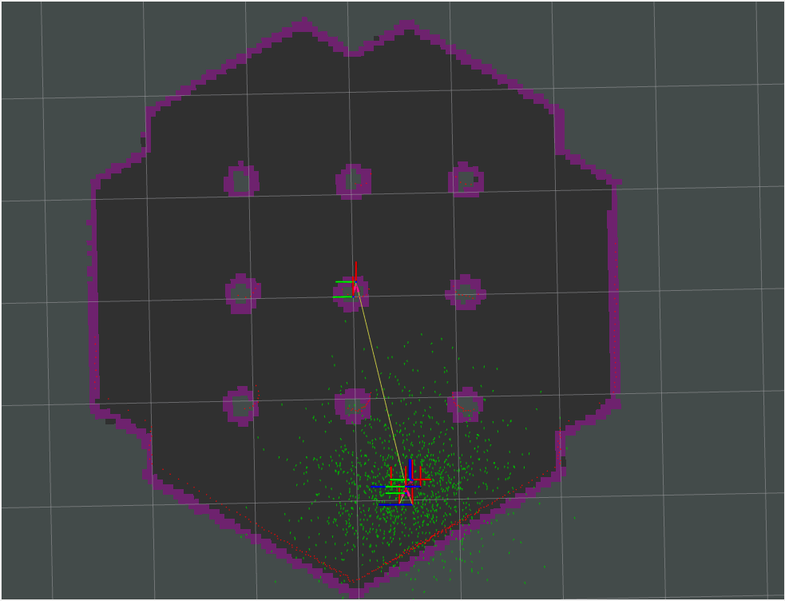

# Aula 17 - Mapas de Custo (Global e Local)

Neste exercício vocês irão visualizar e entender a  cada camada utilizada para construção dos mapas de custos utilizadas pelo **Nav2** para realização da navegação autônoma. Além disso, irão alterar os principais parâmetros de configuração no arquivo ```.yaml``` e analizar sua influência na navegação.

## 1. Camadas dos mapas de custo

Nesta parte do exercício será adicionada uma camada dos mapas de custo de cada vez. Para visualizar como o mapa final é construido e a contribuição de cada camada.

### 1.1 Static layer 

Esta camada é criada a partir do **mapa de ocupação** publicado pelo **map_server**, usualmente no tópico ```/map```. Esta camada basicamente preenche pixels do mapa com base no mapa de ocupação, atribuindo o valor de 255 (**ocupado/lethal**) nos espaços com obstáculos e 0 nos livres.

1. No arquivo de configuração dos parâmetros de navegação (```.yaml```), localize as seções referentes ao ```local_costmap``` e ```global_costmap```.

2. Em cada uma das seções, localize o parâmetro ```plugins```. Este parâmetro define quais camadas, em ordem, que serão adicionadas ao mapa final. No ```global_costmap```, deixe apenas a camada ```static_layer```. Já no ```local_costmap```, deixe só a camada ```voxel_layer```, que veremos em mais detalhes nas próximas seções.

3. Salve o arquivo, compile o workspace e rode a simulação, assim como nas aulas passadas.

4. Uma vez que a simulação carregar, defina a posição inicial do robô para que ele começe a publicar os mapas. Depois, na barra lateral esquerda do **rviz**, retire a visualização da pasta ```Controller```

5. Agora, temos ativa a visualização apenas do **mapa de ocupação** e do **mapa de custo local**, como na imagem abaixo:

    

    

    Ative e desative a visualização do **mapa de ocupação** no **rviz**. Você deve ver que o **mapa de custo global** criado ocupa as mesmas células.

6. Feche a simulação

### 1.2 Obstacle/Voxel Layer

Estas camadas são responsáveis principalmente pela adição de obstáculos dinâmicos, e são criadas/atualizadas em tempo real a partir de leitura de sensores. As duas camadas servem para o mesmo propósito, a diferença entre elas está no tipo de dado que ela processa. Enquanto a ```obstacle_layer``` utilizada dados **2D**, a ```voxel_layer``` utiliza dados 3D.

1. Inicie a simulação, e, uma vez carregada, defina a posição inicial do robô.

2. Na tela do **gazebo**, adicione um elemento (cubo, cilindro, esfera) próximo ao robô.

3. No painel lateral do **rviz**, ative e desative a visualização do ```Controller``` e ```Global Planner```, que contém, respectivamente, a visualização do mapa de custo local e global.

    

    

    

    Você deve ver que o obstáculo colocado próximo ao robô é adicionado ao **mapa de custo local**, porém não ao **mapa de custo global**. Note que, no global, é possível ver as leituras do lidar indicando a presença de um obstáculo, porém ele não é adicionado ao mapa.

4. No arquivo de configuração, adcione a ```obstacle_layer``` aos plugins do ```global_costmap```. Repita os passos anteriores e verifique que, agora, os obstáculos identificados pelo lidar são adicionadas ao mapa gerado.

### 1.3 Inflation Layer

Esta camada é gerada a partir das camadas anteriores. Seu objetivo é "inflar" os obstáculos, ou seja, criar uma região de segurança ao redor deles. Essa região irá conter valores de custo entre 1-253, que irá decair exponencialmente conforme a região se afasta do obstáculo. Esta camada serve, principalmente, para garantir que o planejador mantenha uma distância segura do robô, sem ter que considerar a geometria do robô para isso.

1. Inicie a simulação, e, uma vez carregada, defina a posição inicial do robô.

2. Envie comandos de navegação e veja o robô navegar. Repita o processo até que o caminho planejado passe próximo/rente a um obstáculo.

    Neste caso, o robô deve acabar se chocando com o obstáculo. Isso acontece pois o planejador global utilizado não considera a geometria do robô para o planejamento, ele apenas planeja o caminho de deve ser seuido pelo frame ```base_link``` do robô.

3. Adicione a ```inflation_layer``` na lista de plugins, tanto do ```global_costmap``` quanto do ```local_costmap```. Você deve ver algo como a imagem abaixo:

    

    Veja que agora, em torno de cada obstáculo, uma camada se estende.

4. Envie novamente comandos de navegação. Note que agora o planejador tenta traçar um caminho entre os osbtáculos, se mantendo na região que apresenta o menor **custo** e tentando evitar áreas próximas aos obstáculos, de maior **custo**.

## 2. Principais Parâmetros

Agora que já entendemos o objetivo de cada camada, vamos ver alguns dos principais parâmetros de configuração, utilizados para o tunning do costmap

1. **resolution**: Define a quantos metros na realidade correspondem a um pixel no mapa gerado. O valor é definido em metros.

2. **rolling_window**: Define se o mapa irá "rolar" junto com o robô. Desta forma o robô se mantém sempre ao centro do mapa. ütil em situações onde o mapa é muito grande.

3. **width, height**: Determina o tamanho do mapa

4. **inflation_radius (inflation layer)**: Distância máxima que a camada "inflada" se estenderá a partir do obstáculo

5. **cost_scaling_factor (inflation layer)**: Taxa de decaimento exponencial do custo através da cama inflada.

Altere os parâmetros apresentados acima e verifique como eles influênciam na construção dos mapas e no planejamento/navegação. Para maiores detalhes sobre outros parâmetros de configuração disponíveis, acesse [este link](https://docs.nav2.org/configuration/packages/configuring-costmaps.html)


